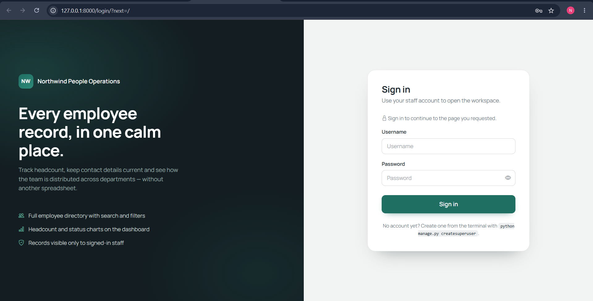
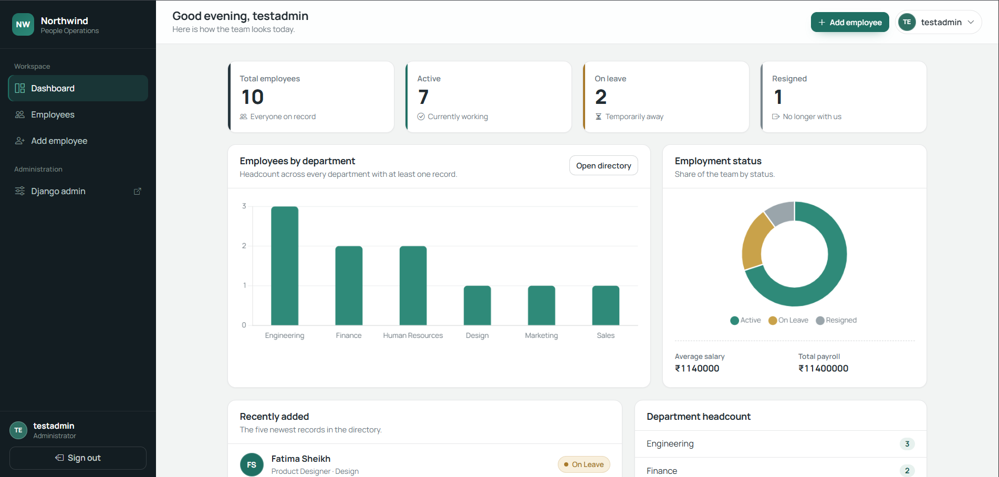
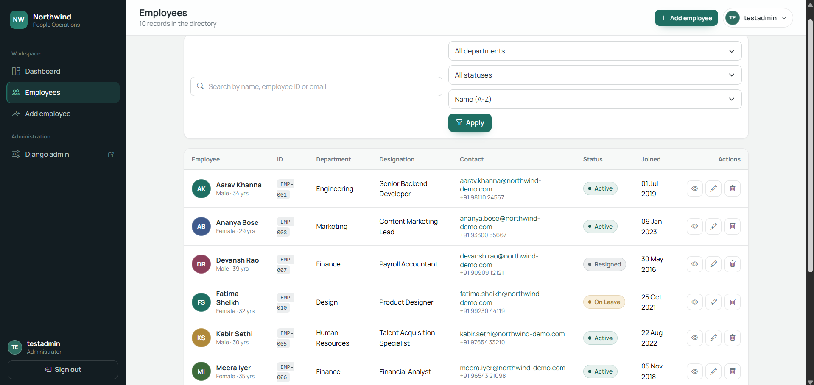
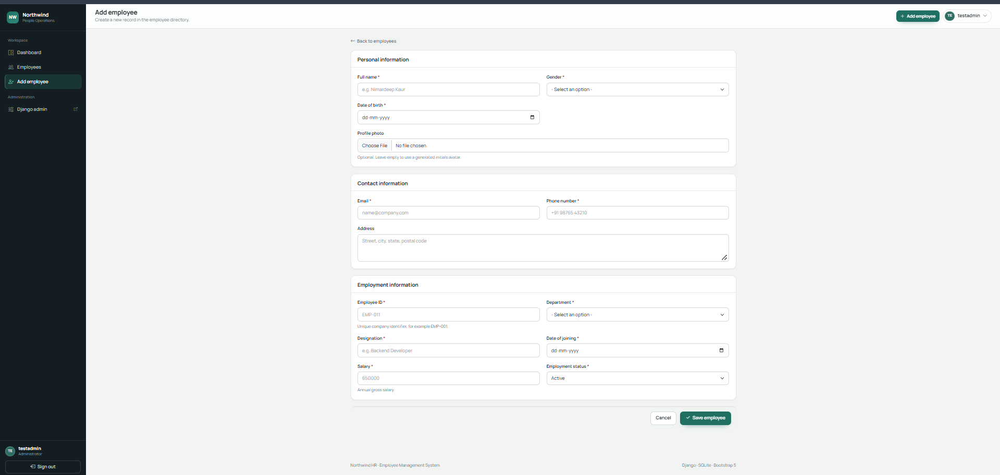

# Employee Management System


A full-stack employee management web application built with **Python and Django**.
Signed-in HR staff can view workforce statistics, search and filter the employee
directory, and create, view, update and delete employee records.

The app follows Django's **MVT (Model–View–Template)** architecture. Everything is
server-rendered: search, filtering, sorting and pagination run in the database
through the Django ORM, and JavaScript is used only for interface details and two
Chart.js charts.

---

## Features

### Dashboard
- Total, active, on-leave and resigned employee counts
- Headcount by department (bar chart) and employment status (doughnut chart)
- Average salary and total payroll, calculated with ORM aggregates (`Count`, `Avg`, `Sum`)
- Five most recently added employees

### Employee management
- Full CRUD through a single Django ModelForm, grouped into Personal, Contact and Employment sections
- Validation errors shown next to each field, with submitted data preserved
- Cross-field rules: date of birth must be in the past, employee must be 18+ on the joining date
- Optional profile photo; employees without one get a generated initials avatar

### Search, filter and sort
- Search by name, employee ID or email
- Filter by department and employment status (filters combine with search)
- Sort by name, employee ID, joining date or salary
- Pagination (8 per page) that keeps the active filters, because all state lives in the URL query string

### Authentication and security
- Every application view is protected with `@login_required`
- Deletion and logout only happen on POST, so a link or a crawler can never delete a record or sign a user out
- CSRF protection on every form
- Passwords hashed by Django; no credentials or secrets committed to the repository
- `SECRET_KEY`, `DEBUG`, `ALLOWED_HOSTS` and the database are read from environment variables
- With `DJANGO_DEBUG=False`: HTTPS redirect, secure cookies and HSTS

### Administration
- Employee model registered in Django Admin with search, filters and grouped fieldsets
- `seed_data` management command that loads ten fictional employees

---

## Tech stack

| Category | Technology |
|---|---|
| Language | Python 3.10+ |
| Backend | Django 6.1 |
| Frontend | HTML5, CSS3, JavaScript, Bootstrap 5, Bootstrap Icons |
| Charts | Chart.js 4 |
| Database | SQLite locally, PostgreSQL in production (via `DATABASE_URL`) |
| Forms | Django ModelForms |
| Images | Pillow |
| Serving | Gunicorn, WhiteNoise |

---

## Screenshots

| Login | Dashboard |
|---|---|
|  |  |

| Employee directory | Add employee |
|---|---|
|  |  |

---

## Project structure

```text
employee-management-system/
├── manage.py
├── requirements.txt
├── build.sh                  # build script for deployment
├── .env.example              # environment variables for production
├── employee_management/      # project settings and root URLs
│   ├── settings.py
│   ├── urls.py
│   ├── asgi.py
│   └── wsgi.py
├── employees/                # the application
│   ├── models.py             # Employee model and validation
│   ├── forms.py              # employee form, filter form, login form
│   ├── views.py              # dashboard, list, detail, create, update, delete
│   ├── urls.py
│   ├── admin.py
│   ├── tests.py              # 18 tests
│   ├── migrations/
│   ├── management/commands/seed_data.py
│   ├── templates/employees/
│   └── static/employees/
└── templates/                # base layout, login, 404 and 500 pages
```

---

## Running locally

```bash
git clone https://github.com/ndk-nimar/employee-management-system.git
cd employee-management-system

python -m venv venv
venv\Scripts\activate          # Windows
source venv/bin/activate       # macOS / Linux

pip install -r requirements.txt
python manage.py migrate
python manage.py createsuperuser   # choose your own username and password
python manage.py seed_data         # loads ten sample employees
python manage.py runserver
```

Open <http://127.0.0.1:8000/>. You will be redirected to the login page. No
environment variables are needed for local development.

Bootstrap, Bootstrap Icons and Chart.js load from a CDN, so the first page load
needs an internet connection.

---

## Running the tests

```bash
python manage.py test
```

18 tests cover model validation, form validation, login protection, dashboard
statistics, search, filtering, create, update and delete. They also run
automatically on every push through GitHub Actions.

---

## Deployment

1. Set the environment variables listed in `.env.example`.
2. Build command: `./build.sh` (installs dependencies, runs `collectstatic` and `migrate`).
3. Start command: `gunicorn employee_management.wsgi`

Uploaded profile photos are stored on the server's local disk. Most free hosts
wipe that disk on redeploy, so production use would need object storage such as S3.

---

## Future improvements

- Role-based access (HR manager vs. read-only viewer)
- Export the filtered employee list to CSV or Excel
- Leave and attendance tracking
- Salary-band and attrition analytics
- A REST API for other internal tools

---

## Author

Nimardeep Kaur — [github.com/ndk-nimar](https://github.com/ndk-nimar)